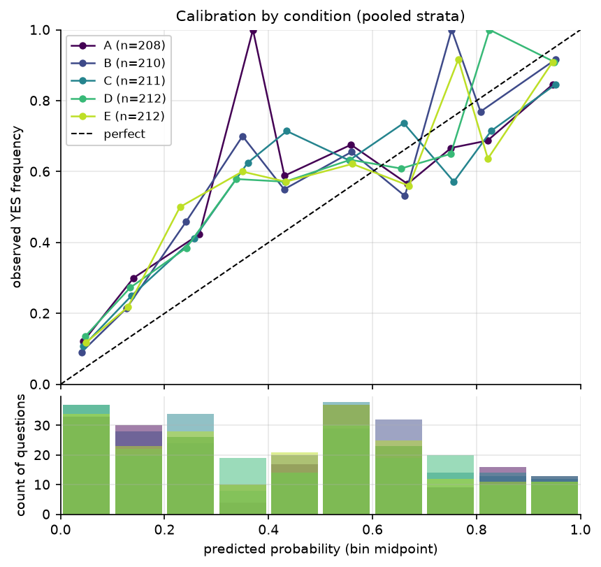

# llm-forecast-calibration

**Finding: Sampling more did not beat thinking harder.** The median of K=10
temperature-1.0 samples scored Brier 0.209 vs 0.205 for a single high-effort forecast
(ΔBrier +0.001, 95% CI [−0.012, +0.014], n=210 paired questions — a null result), and the
Brier-vs-K curve is flat from K=1 to K=10. Raising reasoning effort from low to high
improved Brier by 0.018 (95% CI [−0.034, −0.003]) with no further gain at max. Forcing an
explicit base-rate reasoning procedure *hurt* calibration (ΔBrier +0.011, 95% CI
[+0.000, +0.022]). On resolved Manifold Markets questions, GLM-5.3 beat the constant-0.5
and base-rate baselines but was dominated by the market's own crowd (Brier 0.056 vs
0.21, crowd AUC 0.98) — a comparison the crowd wins partly on information advantage
(see limitations).



## Results

Brier score by condition and baseline, 212 resolved binary questions (106 YES / 106 NO;
110 pre-cutoff / 102 post-cutoff). Lower Brier is better; reliability lower is better;
resolution higher is better.

| Condition | Brier | Reliability | Resolution | ECE (10 bins) | AUC |
|---|---|---|---|---|---|
| A: low effort, K=1 | 0.222 | 0.072 | 0.100 | 0.132 | 0.730 |
| B: high effort, K=1 | **0.205** | 0.071 | 0.116 | 0.121 | 0.764 |
| C: max effort, K=1 | 0.215 | 0.081 | 0.116 | 0.123 | 0.746 |
| D: high effort, K=10, median | 0.209 | 0.117 | 0.157 | 0.114 | 0.761 |
| E: high effort, K=5, base-rate prompt, median | 0.218 | 0.074 | 0.106 | 0.125 | 0.737 |
| Baseline: set base rate (0.5) | 0.250 | — | — | — | 0.500 |
| Baseline: constant 0.5 | 0.250 | — | — | — | 0.500 |
| Baseline: Manifold crowd at close | **0.056** | 0.056 | 0.250 | 0.068 | 0.978 |

Paired-bootstrap comparisons (10,000 resamples over questions, 95% CI):

| Comparison | ΔBrier (A−B) | 95% CI | Verdict |
|---|---|---|---|
| D (median-of-10) vs B (single high) | +0.001 | [−0.012, +0.014] | null |
| D (median-of-10) vs C (single max) | −0.006 | [−0.023, +0.010] | null |
| B (high) vs A (low) | −0.018 | [−0.034, −0.003] | effort helps |
| C (max) vs B (high) | +0.009 | [−0.009, +0.027] | null (max not better) |
| E (base-rate prompt, K=5) vs D first-5 | +0.011 | [+0.000, +0.022] | base-rate prompt hurts |
| D vs crowd | +0.153 | [+0.119, +0.188] | crowd dominates |

**Brier vs K (condition D):** flat. K=1: 0.207 → K=2: 0.200 → K=10: 0.204. There is no
diminishing-returns curve because there are no returns: on this question set, aggregation
neither helps nor hurts. See `figures/brier_vs_k.png`.

**Contamination split (RQ4):** every condition is substantially worse on post-cutoff
questions (e.g. A: 0.180 pre → 0.266 post; D: 0.182 → 0.239). Since pre-cutoff resolutions
were plausibly in training data, this pattern is consistent with outcome memorization
inflating apparent skill on the pre stratum — the honest number is the post-cutoff column.
See `figures/contamination_split.png`.

## Method

212 resolved binary questions from Manifold Markets (public API; balanced 50/50 YES/NO;
crowd baseline = last trade probability before resolution; same-event duplicates
deduplicated). GLM-5.3 via TokenRouter (free tier, 8 req/min → 4,500-call budget
designed around a Sept 4 2026 API deadline) forecast each question under five
conditions: A/B/C = single forecast at reasoning effort low/high/max (temp 0); D =
10 samples at temp 1 (median); E = 5 samples at temp 1 with a forced reference-class →
base-rate → adjust procedure. Prompts gave title, description, resolution criteria, and
the fact the question was resolved, never the outcome; responses were structured JSON
with a probability field. Metrics: Brier, Murphy decomposition (reliability/resolution),
ECE (equal-width and equal-mass), log loss (p clipped to [0.001, 0.999] for log loss
only), AUC, mean |p−0.5|; comparisons via question-level paired bootstrap (calls within
a question are not independent). Parse success: 98.1–99.8% per condition.

## Reproduce

```bash
make all        # parse + test + analyze + figures; fully offline, no API needed
```

Generation (already done, raw data in `data/raw/`): 3,831 successful API calls
(~8.45M completion tokens) over ~21 hours, Sept 2–3 2026. Raw responses are committed
verbatim; every record carries model slug, effort, temperature, prompt version hash,
timestamp, latency, token usage, and attempt number.

## Dataset

`data/questions.jsonl` (questions + outcomes + crowd baselines), `data/raw/` (verbatim
API responses), and `data/parsed/parsed.jsonl` (per-call probabilities) are in this
repo. A HuggingFace dataset mirror is planned — see IDEAS.md status; the repo copy is
canonical.

## Limitations (summary)

Single model, single provider, one question platform, two prompts; assumed (not known)
training cutoff of 2026-08-15 anchoring the contamination split; crowd-baseline
information advantage; truncation-driven dead letters (1.9% worst condition); free-tier
rate limits forced K=10 (not 30) and 212 (not 300+) questions. Full detail in
[LIMITATIONS.md](LIMITATIONS.md).

## License

Code: MIT. Data: CC-BY 4.0.
